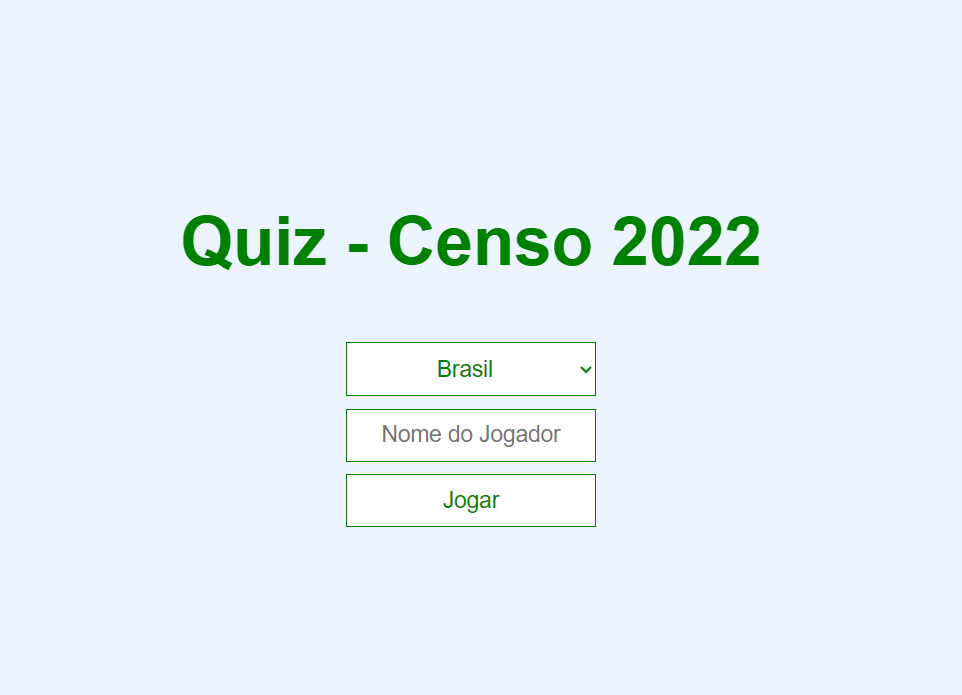
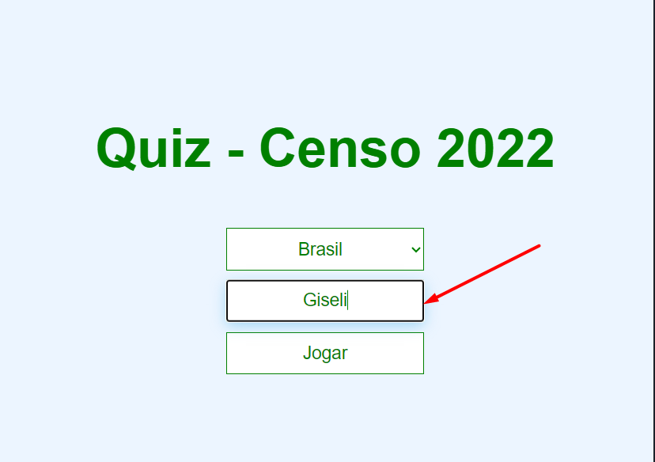
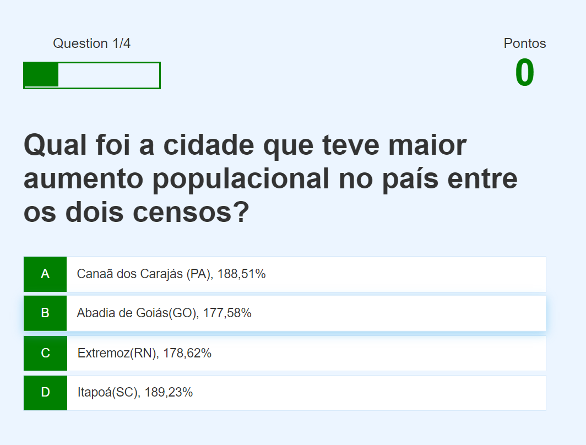
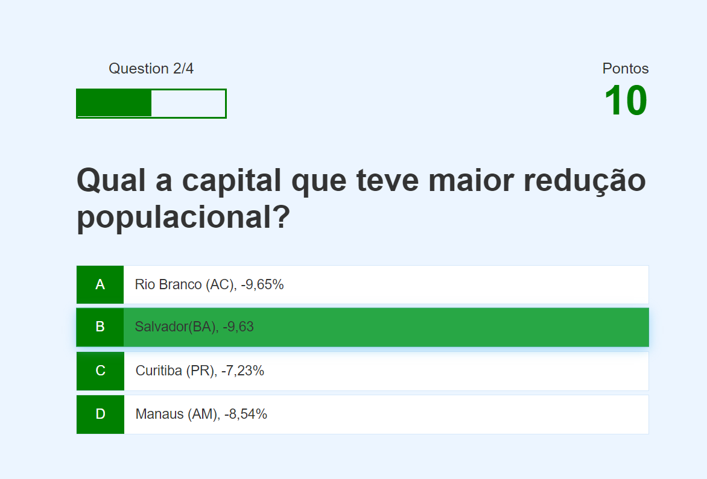
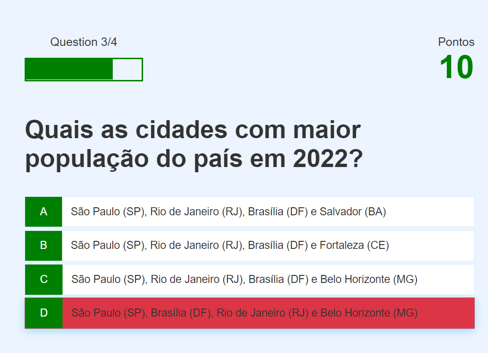
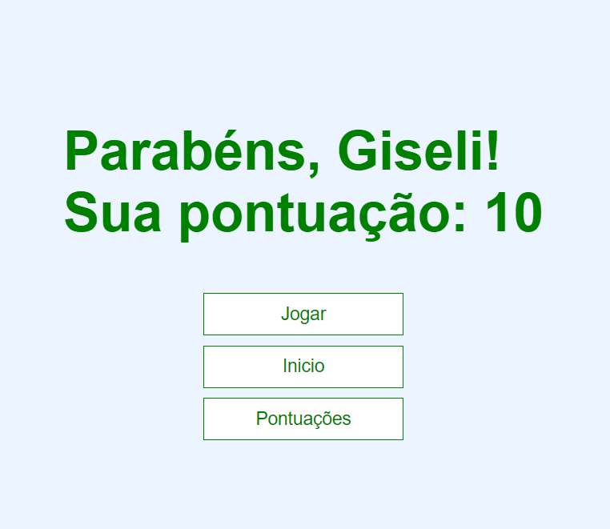
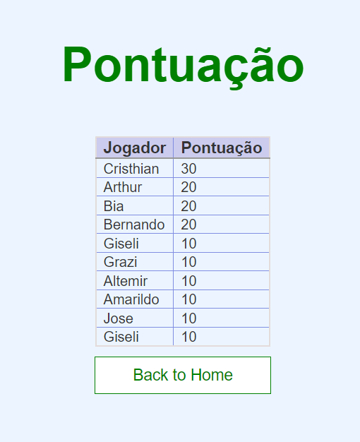

# Construindo um Questionário HTML, CSS e JavaScript.

Lista de reprodução de vídeos: https://share.vidyard.com/watch/uY1mEnobLS442GXMrbS2Vv?

## Introdução do Trabalho Apresentado 

Nosso trabalho consistiu em criar uma pagina de questionarios fundamentados na pesquisa do Censo 2022.

Nosso intiuito é demonstrar o aprendizado de HTML, CSS e JavaScript, juntamente com os dados analisados do Censo 2022.

Fase de Construção ;

## 1. Criamos as Tela de HTML;

- End.html;
- Ranking.html;
- Game.html;
- Index.html;
  
## 2. Criamos as Funções em JavaScript;

- End.js;
- Packge.js;
- Questions.js;
- Ranking.js;
  
## 3. Criamos os arquivos de CSS;

- App.css;
- Game.css;

# Etapas de Uso da Pagina;

## 1. Pagina Inicial;

## 2. Incluir Nome do Jogador;

## 3. Perguntas, barra de evolução da quantidade de perguntas e Total de Pontos;

## 4. Escolha da resposta com Resultado Positivo;

## 5. Escolha da resposta com Resultado Negativo;

## 6. Final do Jogo com Pontuação individual;

## 7. Pontuação com Ranking;

Modelo inspirado no projeto: 
https://github.com/jamesqquick/Build-A-Quiz-App-With-HTML-CSS-and-JavaScript

